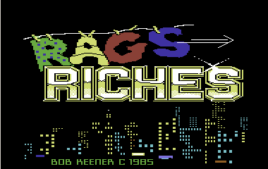

# R2R
 A remake of Rags 2 Riches (C64) game done with Godot

## _Rags to Riches_
Is a  very old Commodore 64 that has been remastereed.

Original game was made in **1985**.

Published by **Melody Hall Publishing**

Concept, Programming, and Music were done by: **Bob Keener**

## _Remastered_
Remastered version done by **CPU** of **UnitedProgramming**

Using **Godot** 4.2.2 Mono version and **C#** on Visual Studio.

Sound Effects: **CPU**

In game Musics: **SliceNDice**, Wictory music **BG Ollie** (This music is from another C64 game.)

Graphics: **CPU** using **GIMP**

## _Goal of the game_
You start with nothing in the city of Perfection.

Make money, get food, drink, rest, and improve your appereance and your education until you reach one milion $.

Beware af the bad guys!

## All items here are under Creative Common License and can be freely reused.
